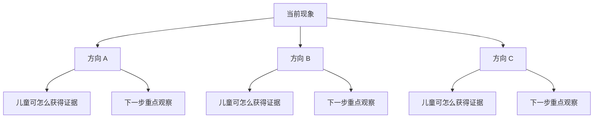

# 输出模板｜问题树

## 纯文本版

```text
【当前现象】________
├─ 【方向 A】________
│  ├─ 儿童可怎么获得证据：________
│  └─ 下一步重点观察：________
├─ 【方向 B】________
│  ├─ 儿童可怎么获得证据：________
│  └─ 下一步重点观察：________
└─ 【方向 C】________
   ├─ 儿童可怎么获得证据：________
   └─ 下一步重点观察：________
```

## Mermaid 版（仅环境支持时）



要求：节点短、最多两层，避免把整份教案塞进图中。
